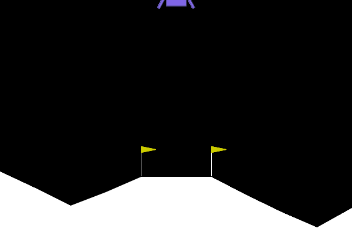

# Deep_Q_Learning
Reinforcement learning with Deep Convolutional Q Learning model 

This project is taken from [Udemy AI course](https://www.udemy.com/course/artificial-intelligence-az/)

# Project Description

We will use a deep convolutional Q Learning model to train a model on PacMan.
The Atari PacMan game with its reward model is obtained through gymnasium package, itself derived from OpenAI gym library for reinforcement learning.

Our objective is to train a DCQN model to play PacMan using reinforcement learning.
Images are fed to the model which predicts the action to implement.

# DCQM Model design

The model is composed of 4 CNN blocks (Convolution layer followed by a batch normalization step and a ReLU rectifier). After a flattening step, the signal is feed into a fully dense neural net with 2 layers.
- model input = game-generated RGB images of resolution 210 x 160 transformed to 128 x 128 RGB images
- model output = vector with size equal to the number of possible actions (9 in total)

# Reinforcement learning algorithm

- Agent with local and target DCQ networks for training
- rewards as per gymnasium library
- replay memory
- epsilon greedy selection of the model recommended action

# results

The agent was trained on a RTX 4090 GPU for 45 minutes on less than 300 episodes for demonstration purpose.
Much longer training is required to achieve decent performance.

Note: for simplier problems, ie no images as input, we can use a simple fully connected network:
- model input = vector corresponding to the state parameters
- model output = vector of size the number of actions

Applied to Gymnasium lunar-landing, we use a network with 3 dense layers. The input is a vector of size 8 (module coordinates x and y, linear velocity in x and y, angle, angular velocity and 2 booleans indicating whether each leg is in contact with the ground) while the output is of size 4 (4 actions possible with main engine, left engine, right engine and do nothing).

The resulting training is much lighter and we can teach an agent to reach the landing pad.

